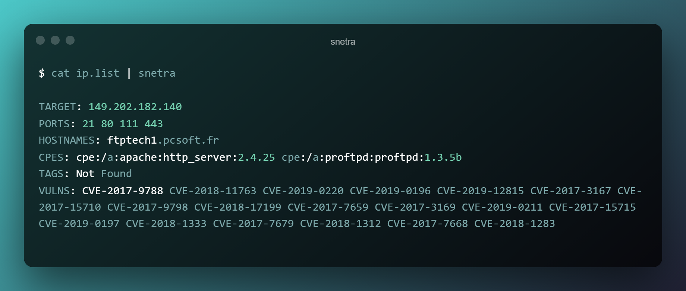

<h1 align="center">

</h1>

A python based script which takes IPs as stdin and scans for open ports and vulnerabilities using [`shodan-internetdb`](https://internetdb.shodan.io/)


> **Note:** _I made it just to check if I implement [`https://gitlab.com/shodan-public/nrich`](https://gitlab.com/shodan-public/nrich) in python or not._


#### **InternetDB**
The InternetDB API provides a fast way to see the open ports for an IP address. It gives a quick, at-a-glance view of the type of device that is running behind an IP address to help you make decisions based on the open ports.

#### **Installation**


```bash
$ pip3 install snetra
```

#### **Usage**


```bash
$ cat ip.list | snetra
```




**Inspired from:** [`https://gitlab.com/shodan-public/nrich`](https://gitlab.com/shodan-public/nrich)


<br>

---
